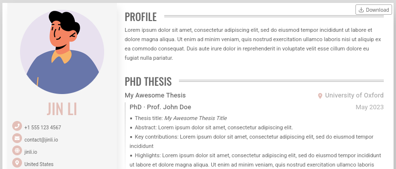

# Jinli CV Theme (锦鲤简历)

Printable HTML/CSS CV template based on the original [Almeida CV](https://github.com/ineesalmeida/almeida-cv) by Inês Almeida (MIT License), extended with multi-CV routing, per-CV language/style control, and new data sections.



**Demo site:**
- Default page: [https://jinli-cv-demo.netlify.app/](https://jinli-cv-demo.netlify.app/)
- German CV: [https://jinli-cv-demo.netlify.app/cv-de/](https://jinli-cv-demo.netlify.app/cv-de/)
- Chinese CV: [https://jinli-cv-demo.netlify.app/cv-zh/](https://jinli-cv-demo.netlify.app/cv-zh/)

This project is a derivative of [Almeida CV](https://github.com/ineesalmeida/almeida-cv) by Inês Almeida (MIT License). Fork maintained at [jin-li/jinli-cv](https://github.com/jin-li/jinli-cv).

---

## What this fork adds

- **Multi-CV support** from `data/<cv-folder>/` with per-CV route by `slug`
- **Per-CV `languageCode`** for section labels and page language
- **Flexible section ordering** via `section_order` and `side_section_order` params
- **Per-CV theme/layout overrides** (colors, column sizes, spacing, section order)
- New **`Publications`** section
  - Linked/italic title support
  - Single timeline-style gradient line in front of list
  - Bullet list styling and print-friendly behavior
- New **`Projects`** section
  - Experience-like visual style
  - Gradient guide line in front of each project's details list
  - Topic, details, and optional badges support
- New **`Thesis`** section
  - Experience-like visual style (timeline, place icon, bullets, badges)
- Better child spacing controls
  - `child_margin` / `child_padding` now apply to list items as well
- Fixed print behavior for long sections and publication lists
- Download button for saving CV as PDF via browser print dialog
- Proper print margins to prevent content from touching page edges

---

## Quick Start (Local Development)

### Prerequisites

- **Hugo Extended** (v0.110.0 or later recommended)
- See install docs: https://gohugo.io/getting-started/installing/

### Option 1: Run the example site (recommended for testing)

The example site expects the theme at `./themes/jinli-cv`. Create a symlink to point to the theme in the parent directory:

```bash
# Clone this repo
git clone https://github.com/jin-li/jinli-cv.git
cd jinli-cv/exampleSite

# Create symlink: themes/jinli-cv -> ../.. (the theme root)
mkdir -p themes
ln -s ../.. themes/jinli-cv

# Start the example site
hugo server -D
```

Site runs at `http://localhost:1313/`.

### Option 2: Create your own site from scratch

```bash
# 1. Create a new Hugo site
hugo new site my-cv
cd my-cv

# 2. Initialize git
git init

# 3. Add this theme as a git submodule
git submodule add https://github.com/jin-li/jinli-cv.git themes/jinli-cv

# 4. Copy the example site content to your site root
cp -r themes/jinli-cv/exampleSite/* .

# 5. (Optional) Remove the example git tracking
rm -rf .git

# 6. Start the dev server
hugo server -D
```

Your site structure will look like:
```
my-cv/
├── config.toml              # Your site config
├── content/
│   └── _content.gotmpl      # Dynamic CV page generator
├── data/
│   ├── content.yaml         # Default CV (homepage)
│   ├── cv-de/
│   │   ├── config.toml
│   │   └── content.yaml
│   └── cv-zh/
│       ├── config.toml
│       └── content.yaml
├── static/
│   └── img/
│       └── avatar.png
└── themes/
    └── jinli-cv/            # Theme submodule
```

---

## Customizing Your CV

### 1. Edit the default CV (homepage)

Edit `data/content.yaml` with your information. See the example in `themes/jinli-cv/exampleSite/data/content.yaml` for all available fields.

**Key sections:**
```yaml
Name:
  first: Your
  last: Name
  order: first_last      # or last_first
  align: center          # left, center, right

Avatar:
  Photo: https://your-avatar-url.com/photo.jpg

Contacts:
  - Icon: fas fa-envelope
    Info: your@email.com
  - Icon: fas fa-globe
    Info: <a class="contact__link" href="https://your-site.com" target="_blank">your-site.com</a>

Profile: "Your professional summary..."

Experience:
  - Employer: Company Name
    Place: City, Country
    Positions:
      - Title: Senior Developer
        Date: 2022 - Present
        Details:
          - Achievement 1
          - Achievement 2
        Badges: ["Go", "Docker", "Kubernetes"]

Education:
  - Course: MSc Computer Science
    Institution: University Name
    Date: 2020 - 2022
    Details:
      - Thesis: "Your Thesis Title"
```

### 2. Add additional CVs (multi-language, different versions)

Create a folder under `data/` for each CV:

```bash
mkdir -p data/cv-de data/cv-fr
```

Each folder needs **two files**:

**`data/cv-de/config.toml`**:
```toml
slug = "cv-de"
title = "Lebenslauf"
languageCode = "de"

[params]
# Override any global params for this CV
section_order = ["profile", "experience", "projects", "education", "skills"]
side_section_order = ["avatar", "name", "contacts", "languages", "interests"]
showDownload = true
download_button = "top_right"
```

**`data/cv-de/content.yaml`**:
```yaml
Name:
  first: Dein
  last: Name
  order: first_last
  align: center

Avatar:
  Photo: https://your-avatar-url.com/photo.jpg

Contacts:
  - Icon: fas fa-envelope
    Info: dein@email.de

Profile: "Dein professionelles Profil auf Deutsch..."

Experience:
  - Employer: Firmenname
    Place: Berlin, Deutschland
    Positions:
      - Title: Senior Entwickler
        Date: 2022 - Heute
        Details:
          - Erfolg 1
          - Erfolg 2
        Badges: ["Go", "Docker", "Kubernetes"]
```

### 3. Replace the avatar

Replace `static/img/avatar.png` with your own photo (recommended: square, ~400x400px).

### 4. Customize colors and layout

Edit `config.toml` under `[params]` to override theme defaults:

```toml
[params]
colorPrimary = "#your-brand-color"
colorLight = "#fff"
colorDark = "#333"
colorPageBackground = "#f5f5f5"
# ... see exampleSite/config.toml for all options
```

### 5. Add custom SCSS (advanced)

Create `assets/scss/_custom.scss` in your site root:

```scss
// Override theme variables
$color-primary: #your-color;
$font-family-base: 'Your Font', sans-serif;

// Custom styles
.your-custom-class {
  // ...
}
```

---

## Building for Production

```bash
# Clean build
hugo --cleanDestinationDir --minify

# Output will be in ./public/
# Deploy the contents of public/ to your hosting provider
```

---

## Deployment Guides

### 🌐 Deploy to Netlify (Recommended - Free Tier)

**Option A: Connect your Git repo (easiest)**

1. Push your site to a Git repo (GitHub, GitLab, Bitbucket)
2. Go to [Netlify](https://app.netlify.com/) → **Add new site** → **Import an existing project**
3. Select your repo
4. Configure build settings:
   - **Base directory**: Leave empty (or `themes/jinli-cv/exampleSite` if you cloned the theme repo directly)
   - **Build command**: `hugo --minify` (or `hugo --gc --minify`)
   - **Publish directory**: `public`
5. Add environment variable: `HUGO_VERSION = 0.146.5` (or your preferred version)
6. Click **Deploy site**

**Option B: Use `netlify.toml` (recommended for reproducibility)**

Create `netlify.toml` in your site root:

```toml
[build]
  command = "hugo --minify"
  publish = "public"

[build.environment]
  HUGO_VERSION = "0.146.5"

# Optional: redirect www to non-www
[[redirects]]
  from = "https://www.yourdomain.com/*"
  to = "https://yourdomain.com/:splat"
  status = 301
  force = true
```

**If using the theme as a submodule**, add this to `netlify.toml`:

```toml
[build]
  command = "git submodule update --init --recursive && hugo --minify"
  publish = "public"
```

Netlify will automatically:
- Clone your repo
- Initialize submodules (fetches the theme)
- Run Hugo build
- Deploy to `https://your-site.netlify.app`
- Set up continuous deployment on every git push

**Custom domain:** Netlify DNS → Add custom domain → Follow verification steps.

---

### 🐙 Deploy to GitHub Pages (Free)

**Option A: GitHub Actions (recommended)**

Create `.github/workflows/hugo.yml`:

```yaml
name: Deploy to GitHub Pages

on:
  push:
    branches: [main, master]
  workflow_dispatch:

permissions:
  contents: read
  pages: write
  id-token: write

concurrency:
  group: "pages"
  cancel-in-progress: true

jobs:
  build:
    runs-on: ubuntu-latest
    steps:
      - name: Checkout
        uses: actions/checkout@v4
        with:
          submodules: recursive  # Important for theme submodule
          fetch-depth: 0

      - name: Setup Hugo
        uses: peaceiris/actions-hugo@v3
        with:
          hugo-version: '0.146.5'
          extended: true

      - name: Build
        run: hugo --minify --gc

      - name: Upload artifact
        uses: actions/upload-pages-artifact@v3
        with:
          path: ./public

  deploy:
    needs: build
    runs-on: ubuntu-latest
    environment:
      name: github-pages
      url: ${{ steps.deployment.outputs.page_url }}
    steps:
      - name: Deploy to GitHub Pages
        id: deployment
        uses: actions/deploy-pages@v4
```

Then in your repo settings:
1. Go to **Settings** → **Pages**
2. **Source**: "GitHub Actions"
3. Your site will be at `https://yourusername.github.io/your-repo-name/`

**Option B: Manual deploy with `gh-pages` branch**

```bash
# Build
hugo --minify --gc

# Deploy to gh-pages branch
cd public
git init
git add .
git commit -m "Deploy"
git push -f https://github.com/yourusername/your-repo.git master:gh-pages
```

---

### ☁️ Deploy to Cloudflare Pages (Free)

1. Go to [Cloudflare Pages](https://pages.cloudflare.com/) → **Create a project**
2. Connect your Git repo
3. Build settings:
   - **Build command**: `hugo --minify`
   - **Build output directory**: `public`
   - **Root directory**: Leave empty (or set if using subfolder)
4. Environment variables: `HUGO_VERSION = 0.146.5`
5. Deploy!

---

### 🚀 Deploy to Vercel (Free Tier)

1. Go to [Vercel](https://vercel.com/) → **Add New Project**
2. Import your Git repo
3. Framework preset: **Hugo**
4. Build settings:
   - **Build Command**: `hugo --minify`
   - **Output Directory**: `public`
5. Deploy!

---

### 🐳 Deploy with Docker (Any VPS/Cloud)

**Dockerfile:**
```dockerfile
FROM klakegg/hugo:0.146.5-ext AS builder
WORKDIR /src
COPY . .
RUN hugo --minify

FROM nginx:alpine
COPY --from=builder /src/public /usr/share/nginx/html
COPY nginx.conf /etc/nginx/conf.d/default.conf
EXPOSE 80
CMD ["nginx", "-g", "daemon off;"]
```

**nginx.conf:**
```nginx
server {
    listen 80;
    server_name localhost;
    root /usr/share/nginx/html;
    index index.html;

    location / {
        try_files $uri $uri/ =404;
    }

    # Enable gzip
    gzip on;
    gzip_types text/css application/javascript;

    # Cache static assets
    location ~* \.(css|js|png|jpg|jpeg|gif|ico|svg|woff|woff2)$ {
        expires 1y;
        add_header Cache-Control "public, immutable";
    }
}
```

Build and run:
```bash
docker build -t my-cv .
docker run -p 8080:80 my-cv
```

---

## Multi-CV Routing Details

The theme automatically generates pages for each folder in `data/` that contains both `config.toml` and `content.yaml`.

| Folder | `slug` in config.toml | URL |
|--------|----------------------|-----|
| `data/` (root) | N/A | `/` (homepage) |
| `data/cv-de/` | `cv-de` | `/cv-de/` |
| `data/cv-zh/` | `cv-zh` | `/cv-zh/` |
| `data/cv-fr/` | `cv-fr` | `/cv-fr/` |

### Per-CV Configuration

Each `data/<cv>/config.toml` can override:

```toml
slug = "cv-fr"           # Required: URL path
title = "CV Français"    # Page title
languageCode = "fr"      # i18n language code

[params]
# Any global param can be overridden per-CV
section_order = [...]
side_section_order = [...]
showDownload = true
colorPrimary = "#different-color"
# ... etc
```

---

## Print / PDF Export

The theme is designed for **A4 printing**:

1. Open your CV in browser
2. Press `Ctrl+P` (or `Cmd+P` on Mac)
3. Settings:
   - **Paper size**: A4
   - **Margins**: None / Default (0.5cm top/bottom are built-in)
   - **Background graphics**: **Enabled** (required for badges, gradients)
   - **Scale**: 100%

Click **Save as PDF** to generate a print-ready PDF.

---

## i18n (Translations)

Section labels are translated via `i18n/*.toml`. Current languages:

| Code | Language | File |
|------|----------|------|
| `en` | English | `i18n/en.toml` |
| `de` | German | `i18n/de.toml` |
| `es` | Spanish | `i18n/es.toml` |
| `eo` | Esperanto | `i18n/eo.toml` |
| `fr` | French | `i18n/fr.toml` |
| `pl` | Polish | `i18n/pl.toml` |
| `zh-cn` | Simplified Chinese | `i18n/zh-cn.toml` |

To add a language:
1. Copy `i18n/en.toml` to `i18n/your-code.toml`
2. Translate all values
3. Use `languageCode = "your-code"` in your CV config

---

## Theme Structure

```
jinli-cv/
├── assets/
│   └── scss/              # SCSS source files
├── exampleSite/           # Complete example site
│   ├── config.toml
│   ├── content/
│   ├── data/
│   └── static/
├── i18n/                  # Translation files
├── images/                # Screenshots for README
├── layouts/
│   ├── cv/                # CV page templates
│   ├── partials/          # Reusable partials
│   └── _default/          # Base templates
├── static/                # Static assets (fonts, etc.)
├── theme.toml             # Theme metadata
└── LICENSE                # MIT License
```

---

## Troubleshooting

### Hugo version issues
```bash
# Check version
hugo version

# Install specific version (macOS)
brew install hugo@0.146.5

# Or download from https://github.com/gohugoio/hugo/releases
```

### Submodule not initialized on Netlify/Vercel
Ensure your build command includes submodule init:
```toml
# netlify.toml
[build]
  command = "git submodule update --init --recursive && hugo --minify"
```

### Theme not found error
If you see `module "jinli-cv" not found`, add to your `config.toml`:
```toml
themesDir = "themes"
theme = "jinli-cv"
```

### Print styles not working
- Enable **Background graphics** in print dialog
- Check browser print preview matches screen
- Ensure `hugo --minify` doesn't strip critical CSS (it shouldn't)

---

## Contributing

1. Fork the repo
2. Create a feature branch: `git checkout -b feature/my-feature`
3. Commit changes: `git commit -am 'Add my feature'`
4. Push: `git push origin feature/my-feature`
5. Open a Pull Request

Issues and pull requests are welcome!

---

## Credits

- **Original theme**: [Almeida CV](https://github.com/ineesalmeida/almeida-cv) by Inês Almeida (MIT License)
- **Fork & extensions**: [jin-li/jinli-cv](https://github.com/jin-li/jinli-cv) (a.k.a. 锦鲤简历) by Jin Li
- **Fonts**: Oswald, Roboto, Material Icons, Font Awesome

---

## License

MIT License - see [LICENSE](LICENSE) for details.

Copyright (c) 2020 Inês Almeida
Copyright (c) 2024-2026 Jin Li